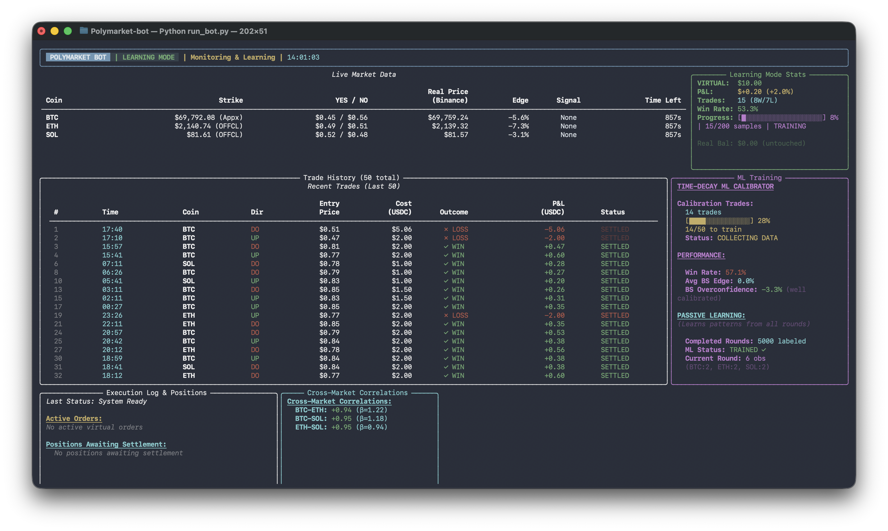
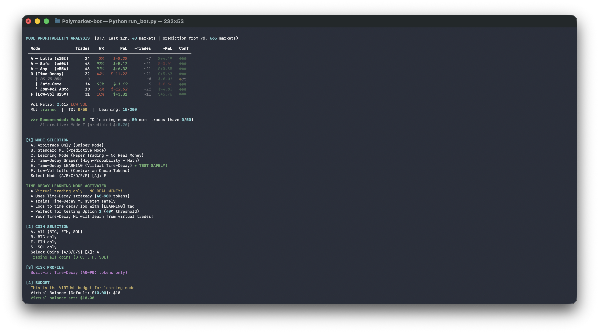

# Polymarket Advanced Trading Bot

An automated, machine-learning-powered cryptocurrency prediction market trading bot specifically designed for Polymarket. This bot features multiple trading modes, real-time data ingestion, dynamic bet sizing, and advanced risk management.

Designed for public use: simply clone, configure your `.env` keys, and run.

---

## 📖 Table of Contents
- [Architecture & Overview](#architecture--overview)
- [Trading Modes & Strategies](#trading-modes--strategies)
- [Bibliographical References](#bibliographical-references)
- [Installation](#installation)
- [Configuration](#configuration)
- [Usage](#usage)
- [Security](#security)

---

## 🖼 Screenshots & Interface

### Main Trading Dashboard
The bot features a high-fidelity, real-time CLI dashboard built with the `rich` library. It monitors active markets, price feeds, and machine learning signals in a non-blocking parallel loop.



### Mode Profitability Analysis (Real-Time Backtesting)
Upon startup, the bot performs a **Dynamic Historical Simulation**. It fetches the last 12–48 hours of resolved markets and Binance price data to "replay" its strategies (A-F). This allows the bot to recommend the most profitable strategy for the *current* market regime before you even place your first trade.



---

## 🏛 Architecture & Overview

The bot is designed to be easily extensible and configurable for public use. It operates via an event-driven loop that:
1. **Ingests Data:** Connects to Polymarket's CLOB (Central Limit Order Book) and external websocket feeds (Binance, Coinbase).
2. **Analyzes:** Feeds data through multi-timeframe analyzers and calculates 15+ technical indicators (RSI, MACD, Bollinger Bands).
3. **Decides:** Uses an ensemble Machine Learning model (Random Forest + Gradient Boosting) or deterministic mathematical arbitrage rules to identify an edge.
4. **Executes:** Places off-chain orders (zero gas fees) via the Polymarket API.
5. **Learns:** Continuously updates its ML models based on recent trade outcomes (Meta-learning).

All personal information and keys are abstracted away into local `.env` files, ensuring your wallet details and API keys are never hardcoded or exposed in the repository.

---

## 📈 Trading Modes & Strategies

You can toggle different strategies in `config/config.yaml` to suit your risk profile and market conditions.

### 1. Standard ML Mode (Default)
Uses machine learning to predict price movements on 15-minute markets. It incorporates cross-market correlations, orderbook depth analysis, and fades overpriced markets (e.g., buying NO when YES is > 85¢).
- **Best for:** Trending markets with sufficient liquidity.

### 2. Pure Arbitrage Mode
Disables ML entirely in favor of mathematical, risk-free (or low-risk) arbitrage.
- **Complement Arbitrage:** Buys both YES and NO if the combined price is < $0.98.
- **Spot Arbitrage:** Compares Polymarket strike prices directly with Binance/Coinbase spot prices.
- **Lotto Strategy:** Buys extremely cheap tokens (< 15¢) when the spot price implies a higher probability.

### 3. Dynamic Entry Window
Adjusts the timing of trade entries based on the detected "edge". High-edge opportunities trigger earlier entries (e.g., 10 minutes before expiry), while low-edge trades are held until the last 5 minutes.

### 4. Late-Game Fallback
Activates in the final 3 minutes if no clear edge was found. It acts as a momentum follower, betting on the direction the market has already committed to (prices between 75¢-85¢) to capture the final 15-25% upside to resolution.

### 5. Low-Vol Lotto Mode F
A contrarian strategy designed for low-volatility regimes. It buys cheap tokens (≤ 25¢) when realized volatility is significantly lower than implied volatility, capitalizing on mispriced tail risks.

### 6. Contrarian Mode
Fades extreme market crowd psychology. It bets against outcomes priced > 85¢ by buying the opposite side for < 15¢, requiring only a 15% win rate to break even.

### 7. Market Making Mode
Provides liquidity to the order book. Places both bids and asks to capture the bid-ask spread and earn Polymarket maker rebates (up to 3.15%).

---

## 📚 Bibliographical References

The strategies and models implemented in this bot are inspired by established quantitative finance literature:

1. **López de Prado, M. (2018).** *Advances in Financial Machine Learning*. John Wiley & Sons. 
   *(Reference for the bot's meta-learning, feature extraction, and ensemble modeling architecture).*
2. **Chen, Y., & Pennock, D. M. (2010).** *A utility framework for bounded-loss market makers*. Proceedings of the 26th Conference on Uncertainty in Artificial Intelligence (UAI).
   *(Foundation for the Market Making Mode and LMSR-aware dynamic sizing).*
3. **Wolfers, J., & Zitzewitz, J. (2004).** *Prediction Markets*. Journal of Economic Perspectives, 18(2), 107-126.
   *(Basis for the Pure Arbitrage and Binary Complement Arbitrage strategies).*

*(See `docs/references/` for included papers and additional materials).*

---

## ⚙️ Installation

### 1. Prerequisites
- Python 3.9+
- TA-Lib (Technical Analysis Library)

**Install TA-Lib:**
- **macOS:** `brew install ta-lib`
- **Ubuntu/Debian:** `sudo apt-get install ta-lib`
- **Windows:** Download and install from [ta-lib.org](https://ta-lib.org)

### 2. Clone and Install Dependencies
```bash
git clone https://github.com/yourusername/polymarket-bot.git
cd polymarket-bot
pip install -r requirements.txt
```

---

## 🔧 Configuration

The bot uses a strict separation of configuration (public) and secrets (private).

### 1. Environment Variables (Secrets)
Copy the template file to create your local `.env`:
```bash
cp .env.example .env
```
Edit `.env` and add your Polygon wallet private key. **Never share this file.**
- `WALLET_PRIVATE_KEY`: Your Polygon private key (exported from MetaMask).
- `POLYGON_RPC_URL`: E.g., `https://polygon-rpc.com`.

### 3. Verify Your Environment
Before running the bot, use the built-in validation script to ensure your RPC connection, wallet, and dependencies are correctly configured:
```bash
python scripts/setup_check.py
```

---

## 🚀 Usage

Ensure your wallet has:
- **USDC.e (Bridged USDC)** on the Polygon network.
- **~0.1 POL** for gas fees (only needed for initial token approvals if using a self-managed wallet).

Run the bot directly as a module:
```bash
python -m src
```

Monitor logs in real-time in your console or check the generated `data/trade_history.json` for performance tracking.

---

## 🔒 Security

- **Private Keys:** Stored ONLY in your local `.env` file. The `.gitignore` prevents this file from being pushed to public repositories.
- **Gas Costs:** Trading on Polymarket's CLOB is off-chain (gas-free).
- **Safety First:** Always start with small amounts (`initial_bet_usdc: 1.0`) to verify your configuration before scaling up.

---

## Disclaimer

This bot is provided for educational and research purposes only. Trading in cryptocurrency and prediction markets involves significant financial risk. The authors are not responsible for any financial losses incurred while using this software.